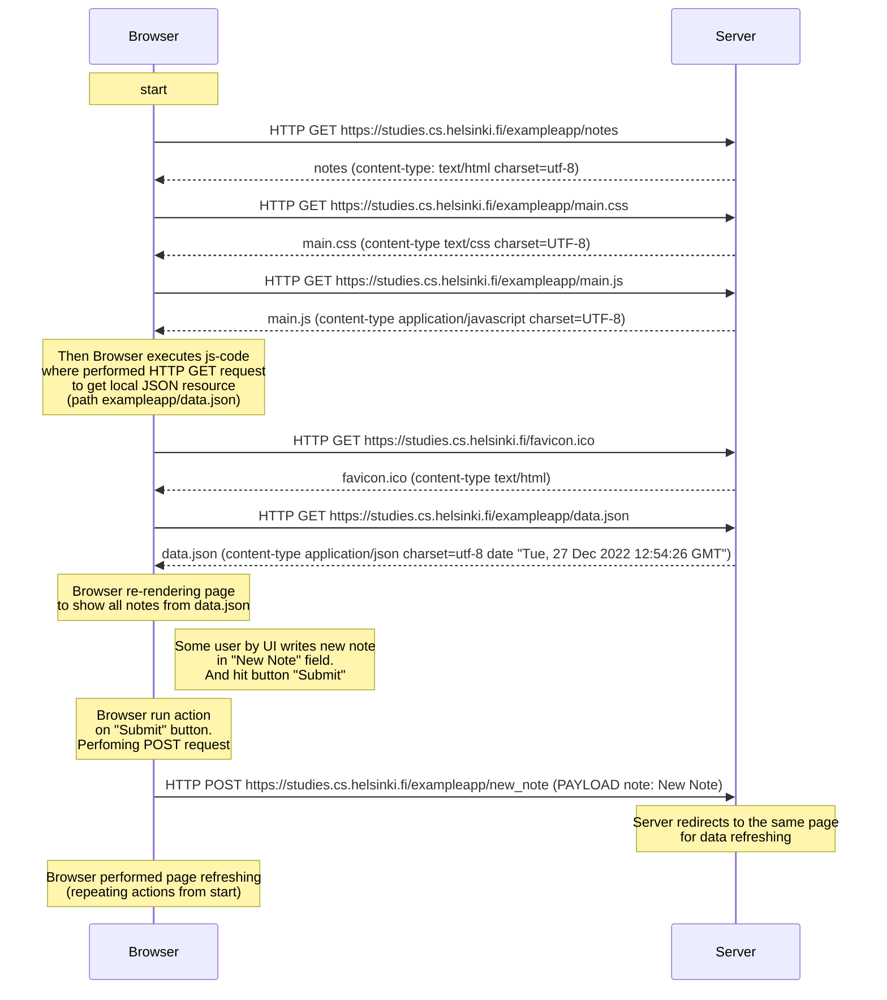

```mermaid
sequenceDiagram

note over Browser: start 
Browser->>Server: HTTP GET https://studies.cs.helsinki.fi/exampleapp/notes
Server-->>Browser: notes (content-type: text/html charset=utf-8)

Browser->>Server: HTTP GET https://studies.cs.helsinki.fi/exampleapp/main.css
Server-->>Browser: main.css (content-type text/css charset=UTF-8)

Browser->>Server: HTTP GET https://studies.cs.helsinki.fi/exampleapp/main.js
Server-->>Browser: main.js (content-type application/javascript charset=UTF-8)

note over Browser: Then Browser executes js-code <br/> where performed HTTP GET request <br/> to get local JSON resource <br/> (path exampleapp/data.json)

Browser->>Server: HTTP GET https://studies.cs.helsinki.fi/favicon.ico
Server-->>Browser: favicon.ico (content-type text/html)

Browser->>Server: HTTP GET https://studies.cs.helsinki.fi/exampleapp/data.json
Server-->>Browser: data.json (content-type application/json charset=utf-8 date "Tue, 27 Dec 2022 12:54:26 GMT")

note over Browser: Browser re-rendering page <br/> to show all notes from data.json

note right of Browser: Some user by UI writes new note <br/> in "New Note" field. <br/> And hit button "Submit"

note over Browser: Browser run action<br/> on "Submit" button. <br/> Perfoming POST request 

Browser->>Server: HTTP POST https://studies.cs.helsinki.fi/exampleapp/new_note (PAYLOAD note: New Note)

note over Server: Server redirects to the same page <br/>  for data refreshing

note over Browser: Browser performed page refreshing  <br/> (repeating actions from start)
```