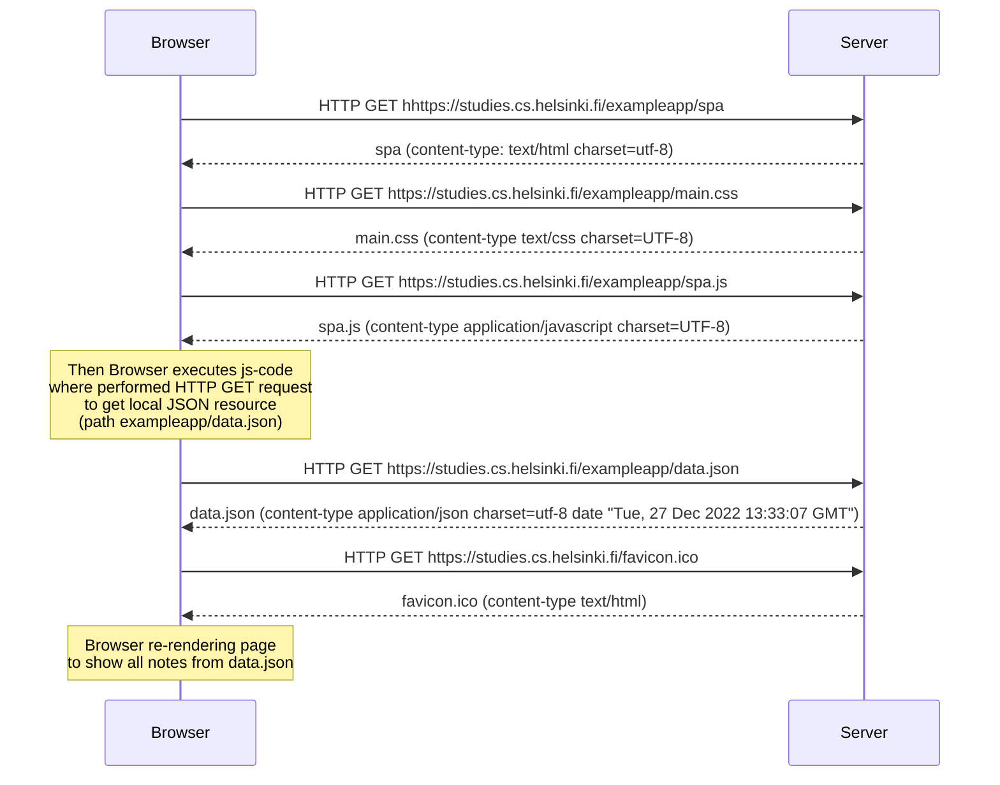

```mermaid
sequenceDiagram

Browser->>Server: HTTP GET hhttps://studies.cs.helsinki.fi/exampleapp/spa
Server-->>Browser: spa (content-type: text/html charset=utf-8)

Browser->>Server: HTTP GET https://studies.cs.helsinki.fi/exampleapp/main.css
Server-->>Browser: main.css (content-type text/css charset=UTF-8)

Browser->>Server: HTTP GET https://studies.cs.helsinki.fi/exampleapp/spa.js
Server-->>Browser: spa.js (content-type application/javascript charset=UTF-8)

note over Browser: Then Browser executes js-code <br/> where performed HTTP GET request <br/> to get local JSON resource <br/> (path exampleapp/data.json)

Browser->>Server: HTTP GET https://studies.cs.helsinki.fi/exampleapp/data.json
Server-->>Browser: data.json (content-type application/json charset=utf-8 date "Tue, 27 Dec 2022 13:33:07 GMT")

Browser->>Server: HTTP GET https://studies.cs.helsinki.fi/favicon.ico
Server-->>Browser: favicon.ico (content-type text/html)

note over Browser: Browser re-rendering page <br/> to show all notes from data.json


```