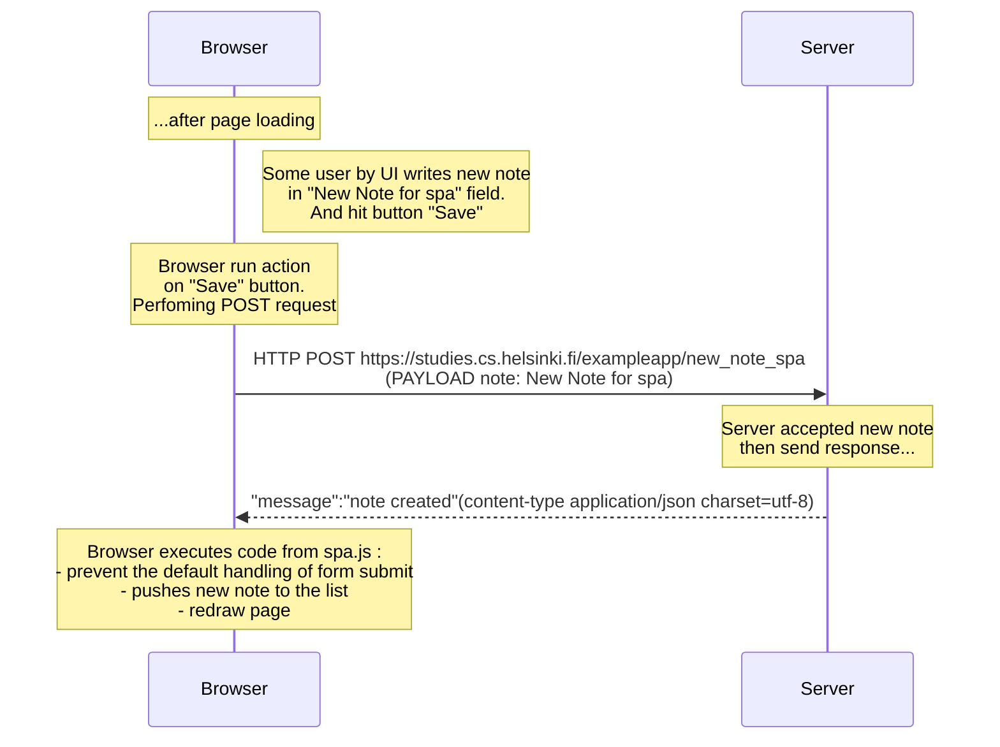

```mermaid
sequenceDiagram

note over Browser: ...after page loading

note right of Browser: Some user by UI writes new note <br/> in "New Note for spa" field. <br/> And hit button "Save"

note over Browser: Browser run action<br/> on "Save" button. <br/> Perfoming POST request 

Browser->>Server: HTTP POST https://studies.cs.helsinki.fi/exampleapp/new_note_spa <br/>  (PAYLOAD note: New Note for spa)

note over Server: Server accepted new note <br/>  then send response...

Server-->>Browser: "message":"note created"(content-type application/json charset=utf-8)

note over Browser: Browser executes code from spa.js :<br/> - prevent the default handling of form submit <br/>- pushes new note to the list <br/>- redraw page 
```