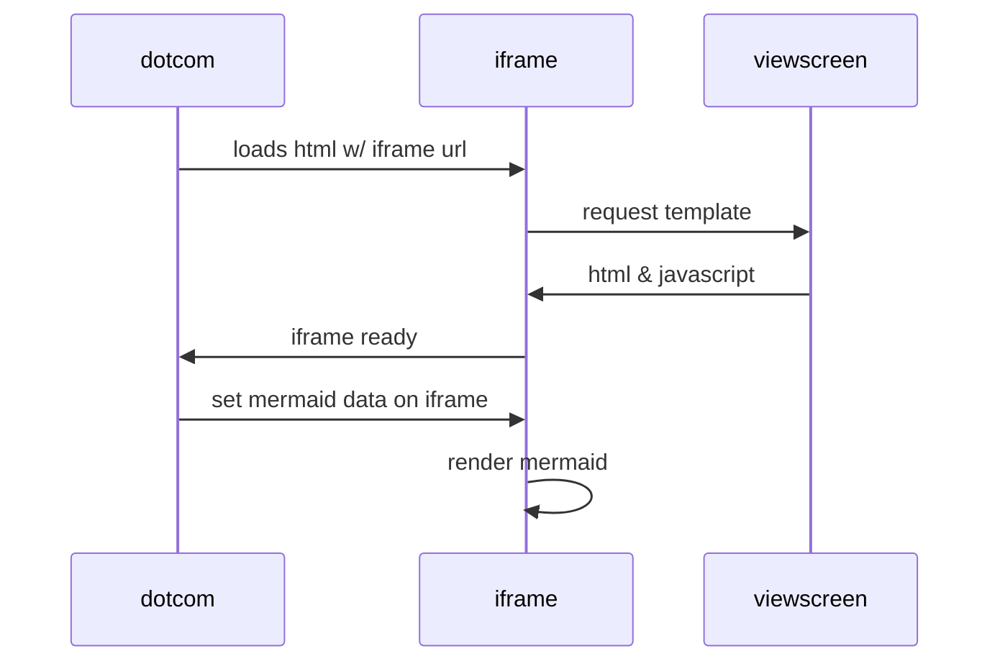

# [FULLSTACKOPEN - Great Oportunity ! ! !](https://fullstackopen.com/en/)
<h1>This is the repository of mine solved exercises from fulstack's course by Helsinki University </h1>
<h2>Part0</h2>

Contains some diagrams(in mermaid markdown) thats looks like that copied example from <a link=https://github.com/mermaid-js/mermaid/blob/develop/README.md>mermaid repo</a>
 

