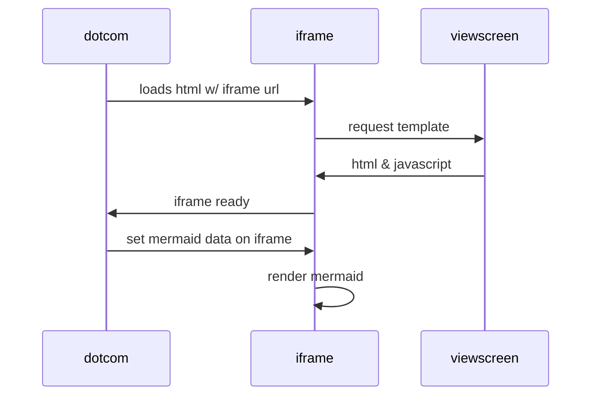

# [FULLSTACKOPEN - Great Oportunity](https://fullstackopen.com/en/)
This is the repository of mine solved exercises from fulstack's course by Helsinki University 
Part0 contains some diagrams(mermaid markdown) like that:

